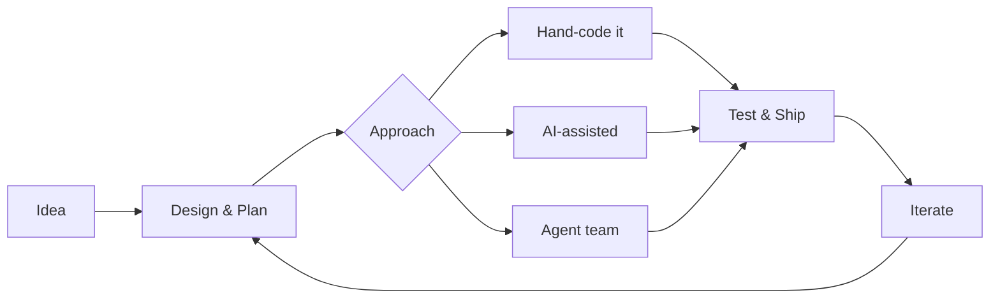

# Hey, I'm Kane

**Developer / Builder / AI Engineer**

I design, code, and ship software -- sometimes solo, sometimes with AI as a collaborator. My projects range from peer-to-peer web apps and crypto trading platforms to indie games and autonomous agent systems. I write code by hand, pair-program with AI, and build tooling that blends both approaches.

 

---

## What I Work With

**AI / LLM:** Claude | ChatGPT | Gemini | Grok | Hermes | Qwen | Ollama | OpenClaw | Local model hosting

---

## Featured Projects

### Web & Mobile Apps

| Project | What it does | Stack | Status | Live |
|---------|-------------|-------|--------|------|
| [**PocketAvalon**](https://github.com/k1bot2026/PocketAvalon) | Board game companion for *The Resistance: Avalon* -- P2P PWA | React, TypeScript, WebRTC |  | [avalon.k1dev.nl](https://avalon.k1dev.nl) |
| [**PocketPoker**](https://github.com/k1bot2026/PocketPoker) | Texas Hold'em chip tracker with P2P networking | React, TypeScript, WebRTC |  | [pocketpoker.k1dev.nl](https://pocketpoker.k1dev.nl) |
| [**MathForge**](https://github.com/k1bot2026/MathForge) | Visual math formula editor using interactive node graphs | Next.js, React Flow, Pyodide |  | |
| [**Repeat**](https://github.com/k1bot2026/Repeat) | No-code automation platform for Dutch small businesses | Next.js, PostgreSQL, n8n, Claude |  | |
| [**AppDev**](https://github.com/k1bot2026/AppDev) | React Native mobile workspace with PocketPoker native app | Expo SDK 54, React Native |  | |

### AI & Automation

| Project | What it does | Stack | Status |
|---------|-------------|-------|--------|
| [**TradeAI**](https://github.com/k1bot2026/TradeAI) | Autonomous crypto trading platform with 3 bot strategies and AI sentiment analysis | Node.js, Solana, Python, PostgreSQL |  |
| [**AI-Management**](https://github.com/k1bot2026/AI-Management) | Full-stack agent management platform with real-time dashboard | Next.js, Express, Socket.IO, SQLite |  |
| [**keep-working**](https://github.com/k1bot2026/keep-working) | Autonomous AI agent team orchestrator for Claude Code | Node.js, npm package |  |
| [**AgentTeam**](https://github.com/k1bot2026/AgentTeam) | Multi-agent AI team framework with Streamlit dashboard | Python, Claude Agent SDK |  |
| [**LocalAI**](https://github.com/k1bot2026/LocalAI) | Local AI gateway that routes tasks to Ollama with API fallback | TypeScript, Ollama, MCP |  |
| [**ForgeAI**](https://github.com/k1bot2026/ForgeAI) | AI-powered engineering design tool with 9 specialized agents | React, Express, Claude API |  |

### Game Development

| Project | What it does | Stack | Status |
|---------|-------------|-------|--------|
| [**DiceDungeon**](https://github.com/k1bot2026/DiceDungeon) | Roguelike deckbuilder with Balatro-inspired dice mechanics | Godot 4.6, GDScript |  |
| [**ScoutBot**](https://github.com/k1bot2026/ScoutBot) | Chambers of Xeric layout scouting bot for OSRS | Java, DreamBot |  |

### AI Development Teams

| Project | What it does | Agents | Status |
|---------|-------------|--------|--------|
| [**GameDev-Team**](https://github.com/k1bot2026/GameDev-Team) | AI game development team with autonomous workflow | 8 agents |  |
| [**WebDev-Team**](https://github.com/k1bot2026/WebDev-Team) | AI web development team for WordPress and JS frameworks | 6 agents |  |

### Plugins & Tools

| Project | What it does | Stack | Status |
|---------|-------------|-------|--------|
| [**kanboard-plugin-teamwork**](https://github.com/k1bot2026/kanboard-plugin-teamwork) | Multi-person task assignment plugin for Kanboard | PHP, MySQL, SQLite, PostgreSQL |  |

---

## How I Build

I work across the full spectrum -- from writing code entirely by hand to orchestrating multi-agent AI teams. The approach depends on the project: sometimes I'm deep in GDScript building game mechanics, sometimes I'm architecting a system and delegating implementation to AI agents working in parallel. I use whichever AI tool fits the task: **Claude**, **ChatGPT**, **Gemini**, **Grok**, **Hermes**, **Qwen**, **OpenClaw**, or local models via **Ollama** -- often combining multiple in a single project.

My [keep-working](https://github.com/k1bot2026/keep-working) tool and [LocalAI](https://github.com/k1bot2026/LocalAI) gateway automate the AI side -- routing tasks to local or cloud models based on complexity, while I focus on architecture, design decisions, and the code that matters most.

---

*Writing code, building tools, shipping projects.*

