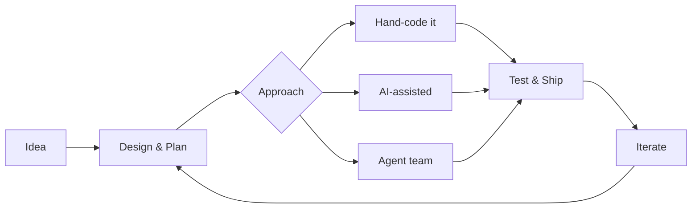

<div align="center">

# Hey, I'm Kane

**Developer / Builder / AI Engineer**

I design, code, and ship software -- sometimes solo, sometimes with AI as a collaborator. My projects range from peer-to-peer web apps and crypto trading platforms to indie games and autonomous agent systems. I write code by hand, pair-program with AI, and build tooling that blends both approaches.

[](https://github.com/k1bot2026)
[](https://k1dev.nl)

</div>

---

## What I Work With

```
Languages       TypeScript  JavaScript  Python  GDScript  PHP  Java  R  Shell
Frontend        React 19  Next.js  Vite  Tailwind CSS  shadcn/ui  React Native  Expo
Backend         Node.js  Express  FastAPI  Flask  PostgreSQL  SQLite  Redis
Game Dev        Godot 4.6  Unity  GDScript  Pixel Art
AI / LLM        Claude  ChatGPT  Gemini  Grok  Hermes  Qwen  Ollama  OpenClaw
AI Tooling      Claude Code  Agent SDK  MCP Protocol  Local model hosting
Infrastructure  Docker  n8n  BullMQ  Hetzner  Strato
```

---

## Featured Projects

### Web & Mobile Apps

| Project | What it does | Stack | Live |
|---------|-------------|-------|------|
| [**PocketAvalon**](https://github.com/k1bot2026/PocketAvalon) | Board game companion for *The Resistance: Avalon* -- replaces all physical components with a peer-to-peer PWA | React, TypeScript, WebRTC | [avalon.k1dev.nl](https://avalon.k1dev.nl) |
| [**PocketPoker**](https://github.com/k1bot2026/PocketPoker) | Texas Hold'em chip tracker -- replaces physical chips with P2P networking | React, TypeScript, WebRTC | [pocketpoker.k1dev.nl](https://pocketpoker.k1dev.nl) |
| [**MathForge**](https://github.com/k1bot2026/MathForge) | Visual math formula editor using interactive node graphs | Next.js, React Flow, Pyodide | |
| [**Repeat**](https://github.com/k1bot2026/Repeat) | No-code automation platform for Dutch small businesses | Next.js, PostgreSQL, n8n, Claude | |
| [**AppDev**](https://github.com/k1bot2026/AppDev) | React Native mobile workspace with PocketPoker native app | Expo SDK 54, React Native | |

### AI & Automation

| Project | What it does | Stack |
|---------|-------------|-------|
| [**TradeAI**](https://github.com/k1bot2026/TradeAI) | Autonomous crypto trading platform with 3 bot strategies, dashboard, and AI sentiment analysis | Node.js, Solana, Python, PostgreSQL |
| [**AI-Management**](https://github.com/k1bot2026/AI-Management) | Full-stack agent management platform with real-time dashboard | Next.js, Express, Socket.IO, SQLite |
| [**keep-working**](https://github.com/k1bot2026/keep-working) | Autonomous AI agent team orchestrator for Claude Code (published on npm) | Node.js, npm package |
| [**AgentTeam**](https://github.com/k1bot2026/AgentTeam) | Multi-agent AI team framework with orchestration and Streamlit dashboard | Python, Claude Agent SDK |
| [**LocalAI**](https://github.com/k1bot2026/LocalAI) | Local AI gateway that routes tasks to Ollama models with API fallback | TypeScript, Ollama, MCP |
| [**ForgeAI**](https://github.com/k1bot2026/ForgeAI) | AI-powered engineering design tool with 9 specialized agents | React, Express, Claude API |

### Game Development

| Project | What it does | Stack |
|---------|-------------|-------|
| [**DiceDungeon**](https://github.com/k1bot2026/DiceDungeon) | Roguelike deckbuilder with Balatro-inspired dice mechanics -- targeting Steam Early Access | Godot 4.6, GDScript |
| [**ScoutBot**](https://github.com/k1bot2026/ScoutBot) | Chambers of Xeric layout scouting bot for OSRS | Java, DreamBot |

### AI Development Teams

| Project | What it does | Agents |
|---------|-------------|--------|
| [**GameDev-Team**](https://github.com/k1bot2026/GameDev-Team) | AI game development team with autonomous workflow | 8 agents (Director, Dev, Artist, Designer, QA, Audio, Docs) |
| [**WebDev-Team**](https://github.com/k1bot2026/WebDev-Team) | AI web development team for WordPress and JS frameworks | 6 agents (Builder, Architect, Developer, Content) |

### Plugins & Tools

| Project | What it does | Stack |
|---------|-------------|-------|
| [**kanboard-plugin-teamwork**](https://github.com/k1bot2026/kanboard-plugin-teamwork) | Multi-person task assignment plugin for Kanboard | PHP, MySQL, SQLite, PostgreSQL |

---

## How I Build

I work across the full spectrum -- from writing code entirely by hand to orchestrating multi-agent AI teams. The approach depends on the project: sometimes I'm deep in GDScript building game mechanics, sometimes I'm architecting a system and delegating implementation to AI agents working in parallel. I use whichever AI tool fits the task: **Claude**, **ChatGPT**, **Gemini**, **Grok**, **Hermes**, **Qwen**, **OpenClaw**, or local models via **Ollama** -- often combining multiple in a single project.

My [keep-working](https://github.com/k1bot2026/keep-working) tool and [LocalAI](https://github.com/k1bot2026/LocalAI) gateway automate the AI side -- routing tasks to local or cloud models based on complexity, while I focus on architecture, design decisions, and the code that matters most.



---

<div align="center">

*Writing code, building tools, shipping projects.*

</div>
